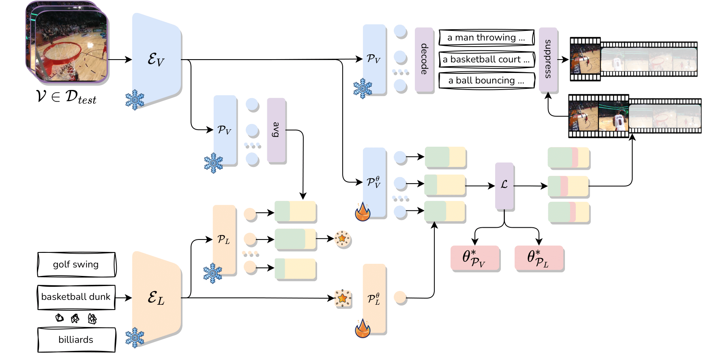

<div align="center">

[](https://arxiv.org/abs/2404.05426)
[](https://benedettaliberatori.github.io/T3AL/)

# Test-Time Zero-Shot Temporal Action Localization

[Benedetta Liberatori](https://benedettaliberatori.github.io/), [Alessandro Conti](https://alessandroconti.me/), [Paolo Rota](https://paolorota.github.io/), [Yiming Wang](https://www.yimingwang.it/), [Elisa Ricci](http://elisaricci.eu/) <br>


<div align="left">

> **Abstract:** Zero-Shot Temporal Action Localization (ZS-TAL) seeks
to identify and locate actions in untrimmed videos unseen
during training. Existing ZS-TAL methods involve fine-
tuning a model on a large amount of annotated training
data. While effective, training-based ZS-TAL approaches as-
sume the availability of labeled data for supervised learning,
which can be impractical in some applications. Furthermore,
the training process naturally induces a domain bias into the
learned model, which may adversely affect the model’s gen-
eralization ability to arbitrary videos. These considerations
prompt us to approach the ZS-TAL problem from a radically
novel perspective, relaxing the requirement for training data.
To this aim, we introduce a novel method that performs Test-
Time adaptation for Temporal Action Localization (T<sup>3</sup>AL).
In a nutshell, T<sup>3</sup>AL adapts a pre-trained Vision and Lan-
guage Model (VLM) at inference time on a sample basis.
T<sup>3</sup>AL operates in three steps. First, a video-level pseudo-
label of the action category is computed by aggregating
information from the entire video. Then, action localization
is performed adopting a novel procedure inspired by self-
supervised learning. Finally, frame-level textual descriptions
extracted with a state-of-the-art captioning model are em-
ployed for refining the action region proposals. We validate
the effectiveness of T<sup>3</sup>AL by conducting experiments on the
THUMOS14 and the ActivityNet-v1.3 datasets. Our results
demonstrate that T 3 AL significantly outperforms zero-shot
baselines based on state-of-the-art VLMs, confirming the
benefit of a test-time adaptation approach. 


# Setup

We recommend the use of a Linux machine with CUDA compatible GPUs. We provide a Conda environment to configure the required libraries.

Clone the repo with:

```bash
git clone ...
cd T3AL
```

## Conda

The environment can be installed and activated with:

```bash
conda create --name t3al python=3.8
conda activate t3al
pip install -r requirements.txt
```


# Preparing Datasets
We recommend to use pre-extracted CoCa features to accelerate inference. Please download the extracted features for THUMOS14 and ActivityNet-v1.3 datasets from links below. 

In the same folder, you will find captions generated with CoCa. Given the size of the datasets, we generated caption at 10 fps for THUMOS14 and 1 fps for ActivityNet-v1.3. 

## Pre-extracted Features


|   Dataset    |                                                 Link                                                  |    Captions    |
| :----------: | :---------------------------------------------------------------------------------------------------: |     :----------:    | 
| THUMOS14   | [Google Drive](https://drive.google.com/file/d/1SARGjmIZElUvPi2KTXurCtUkXNR_VraI/view?usp=sharing) |        [Google Drive](https://drive.google.com/file/d/1zRCvqkMYjLYKPGv1mWw4zA6Ng-hYUI5e/view?usp=sharing)                 |
|  ActivityNet-v1.3  | [Google Drive](https://drive.google.com/drive/folders/10L2iapJO-59MMPHb-Hx9Gw6F9Dpbk_Br?usp=sharing) |   [Google Drive](https://drive.google.com/file/d/14Tk3ISD8t2pTOMrd8sbDRiYTRrXnL3iZ/view?usp=sharing)  |


Then add the paths in the config files `config/<dataset_name>.yaml`, for example as: 

```
training:
  feature_path: '/path/to/Thumos14/features/'
  video_path: '/path/to/Thumos14/videos/'
```

# Evaluation

The method can be evaluated on the `dataset` of interest and selecting the `split` and `setting`, by running the following bash script:

```bash
python src/train.py experiment=tt_<dataset_name> data=<dataset_name> model.video_path=</path/to/data/> model.split=<split> model.setting=<setting> data.nsplit=0 exp_name=<exp_name>
```

We provide config files for the main method `tt_<dataset_name>`, the training free baseline `tf_<dataset_name>` and the baselines `baseline`. 

# Citation

Please consider citing our paper in your publications if the project helps your research.

```
@InProceedings{Liberatori_2024_CVPR,
    author    = {Liberatori, Benedetta and Conti, Alessandro and Rota, Paolo and Wang, Yiming and Ricci, Elisa},
    title     = {Test-Time Zero-Shot Temporal Action Localization},
    booktitle = {Proceedings of the IEEE/CVF Conference on Computer Vision and Pattern Recognition (CVPR)},
    month     = {June},
    year      = {2024},
    pages     = {18720-18729}
}
```
